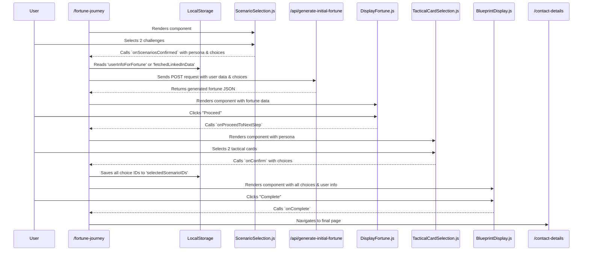

# Fortune Teller Application: Codebase Documentation

## 1. Overview

This document provides a comprehensive overview of the MW Fortune Teller application, a multi-stage, interactive experience designed to generate a personalized marketing blueprint for users. The application features two primary user-entry flows, a sophisticated journey conductor, and several server-side API endpoints for AI-powered content generation.

## 2. Core User Flows

The application begins at the `/collect-info` page, where the user chooses one of two paths:

### Flow A: The LinkedIn Flow (Automated)

-   **Entry Point:** User scans their LinkedIn QR code or provides their profile URL.
-   **Mechanism:** The application initiates a background process via the `/generating-fortune` page to fetch the user's LinkedIn data and generate their initial fortune.
-   **User Experience:** The user is directed to a `/linkedin-interlude` page, which acts as a "waiting room." This page listens for the `fortuneData` key to appear in `localStorage`.
-   **Handoff:** Once the fortune is generated and saved to `localStorage`, the user is automatically redirected to `/fortune-journey` to begin the interactive experience.

### Flow B: The Manual Entry Flow (Corrected)

-   **Entry Point:** User opts to fill out a form with their name, company, industry, and optional details.
-   **Mechanism:** Upon submission, the user's information is saved to `localStorage`.
-   **User Experience:** The user is redirected **directly** to the `/fortune-journey` page.
-   **Handoff:** The `fortune-journey` page handles the initial fortune generation *after* the user makes their first set of choices, using the data stored in `localStorage`.

## 3. Key `localStorage` Usage

`localStorage` is the backbone of state management between pages and asynchronous operations.

-   `userInfoForFortune`: (Manual Flow) A JSON object containing the user's manually entered information.
-   `fetchedLinkedInData`: (LI Flow) A raw JSON object containing the complete scraped data from the user's LinkedIn profile.
-   `pendingFortuneRequestBody`: (LI Flow) A subset of user info prepared just before the background fortune generation call.
-   `fortuneData`: Stores the complete JSON object of the user's initial fortune, generated by the `/api/generate-initial-fortune` endpoint. The presence of this key signals that the `/linkedin-interlude` page should proceed.
-   `selectedScenarioIDs`: An array of all question/challenge IDs selected by the user throughout their entire journey (both high-level and tactical). Used by the final summary pages.
-   `fortuneGenerationError`: A flag used to communicate an error from the background generation process to the interlude page.

## 4. Component & Page Breakdown

### The Conductor: `app/fortune-journey/page.js`

This is the most critical component in the application. It acts as a client-side state machine, managing the user's progression through the interactive journey.

-   **State Management:** It uses a `currentStage` state variable to control which component is rendered. The stages are: `highLevelSelection`, `initialFortuneReveal`, `tacticalSelection`, and `finalBlueprint`.
-   **Data Orchestration:** It is responsible for triggering the initial fortune generation API call at the correct moment and passing the resulting data as props to its children components.

#### Data Flow within the Fortune Journey

### Journey Components

-   **`ScenarioSelection.js`:** The first step. Captures the user's two high-level challenges and determines their `persona`.
-   **`DisplayFortune.js`:** Displays the initial AI-generated fortune, featuring a multi-stage audio narration.
-   **`TacticalCardSelection.js`:** The second selection step. Presents persona-specific tactical challenges (Tarot cards for 'advertiser', icons for others).
-   **`BlueprintDisplay.js`:** The final summary. Uses the collected choices to look up solutions from `product_mapping.json` and presents the user's complete strategic blueprint.

### Supporting Pages

-   **`app/collect-info/page.js`:** The main entry point for both user flows.
-   **`app/linkedin-interlude/page.js`:** The waiting room for the LinkedIn flow.
-   **`app/scenario-answers/page.js`:** An optional, post-journey page that reads `selectedScenarioIDs` from `localStorage` and fetches detailed answers for each.

## 5. API Endpoints

-   **/api/generate-initial-fortune:** The primary AI endpoint.
    -   **Trigger:** Called by `fortune-journey/page.js` after the user makes their high-level choices.
    -   **Input:** A JSON payload containing the user's profile, persona, and selected questions.
    -   **Logic:** Constructs a highly detailed, conditional prompt for the Google Gemini AI model. It adapts the prompt based on whether a specific geographic location was provided to avoid generating generic or nonsensical content.
    -   **Output:** Returns a structured JSON object containing the `openingStatement` and two `insights`.
-   **/api/generate-scenario-answers:** Provides detailed, structured solutions for all chosen scenarios for the `/scenario-answers` page.
-   **/api/transcribe-audio:** A utility endpoint that uses OpenAI Whisper to transcribe voice input from the manual entry form.
